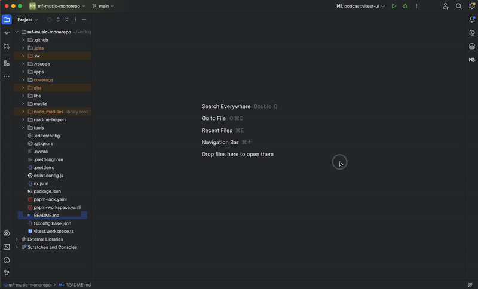

# Inditex Challenge

## Descripción General
Este repositorio contiene la solución al challenge técnico de Inditex para el puesto de Tech Lead Frontend. La solución implementa una arquitectura basada en **micro-frontends** utilizando un monorepo integrado gestionado con **Nx**, además de tecnologías modernas como **React**, **Vite**, **Vitest**, y **Module Federation**.

## Características principales
- **Micro-frontends**: La solución está separada en aplicaciones individuales (shell y podcast) con una arquitectura modular.
- **Design System**: Librerías reutilizables para componentes, utilidades, enrutamiento, y APIs.
- **DevOps**: Despliegue continuo a **Vercel** mediante PRs y merges a `main`.
- **Testing**: Integración con **Vitest** y Nx para pruebas unitarias y visualización de cobertura.

---

## Requisitos previos
1. Node.js 22.12.0 (gestionado con `.nvmrc`).
2. PNPM como gestor de paquetes.

Para instalar las dependencias:
```bash
pnpm install
```

---

## Estructura del Monorepo
- **`apps/`**: Contiene las aplicaciones principales.
  - **`shell/`**: Aplicación host.
  - **`podcast/`**: Aplicación remota con la funcionalidad principal.
- **`libs/`**: Librerías reutilizables.
  - **`cdk/`**: Component Dev Kit.
  - **`api/`**, **`utils/`**, **`icons/`**, **`router/`**.
- **`tools/`**: Scripts personalizados de Nx.
- Archivos de configuración clave: `nx.json`, `pnpm-workspace.yaml`, `tsconfig.base.json`.

---

## Front end System Design


## Scripts Disponibles
Los scripts se ejecutan desde el directorio raíz:

### Desarrollo
- **Arrancar todas las aplicaciones**:
  ```bash
  pnpm start:all:dev
  ```
- **Arrancar una aplicación específica** (reemplaza `$PROJECT`):
  ```bash
  pnpm start:project:dev --PROJECT=shell
  ```

### Construcción
- **Construir todas las aplicaciones**:
  ```bash
  pnpm build:apps
  ```
- **Construir librerías**:
  ```bash
  pnpm build:libs
  ```

### Testing
- **Ejecutar todos los tests**:
  ```bash
  pnpm test:all
  ```
- **Ejecutar tests de un proyecto** (reemplaza `$PROJECT`):
  ```bash
  pnpm test:project --PROJECT=podcast
  ```
- **Ejecutar pruebas con interfaz gráfica de Vitest**: (reemplaza `$PROJECT`):
  ```bash
  pnpm test:project:ui --PROJECT=podcast
  ```

  #### **Con la consola de Nx****:
  
  

  #### **Con el terminal**:
  
  

  #### **Vitest UI**

  

### Nx Utilidades
- **Visualizar el grafo de dependencias**:
  ```bash
  pnpm graph
  ```

### Nx Console**
- **Adicionalmente, se puede instalar el plugin **Nx console** en el IDE de preferencia para acceder a todos los scripts desde el dashboard de Nx**:
  


---

## Deployment
El proyecto se despliega automáticamente a **Vercel** al hacer un merge en la rama `main`.

---

## Herramientas Destacadas
- **Nx**:
  - Manejo de cache y tareas inteligentes.
  - Comandos personalizados en `tools/utils`.
- **Vitest**: Configurado para pruebas unitarias y cobertura visual.
- **Vercel**: Pipeline de CI/CD configurado para despliegues rápidos.

Para más detalles sobre las aplicaciones y librerías, revisa los archivos `README.md` en cada subdirectorio:

- [Shell](./apps/shell/README.md)
- [Podcast](./apps/podcast/README.md)
- [libs](./libs/README.md)
- [tools](./tools/README.md)
