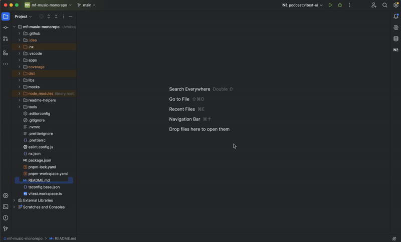
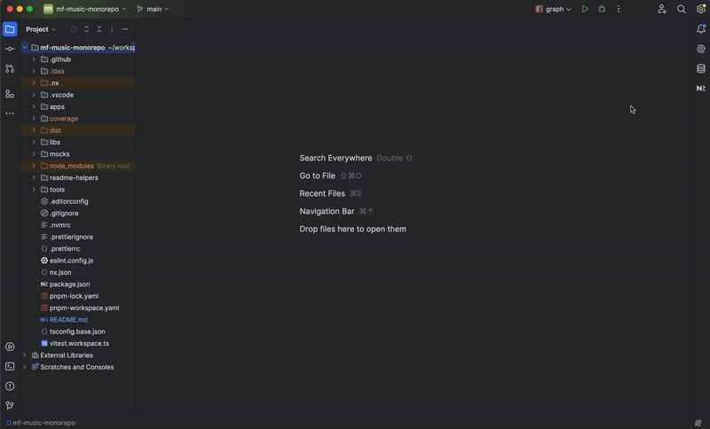

# Module Federation Music App

## Overview
This mono-repository contains the solution of a technical challenge for the Tech Lead Frontend position. The solution implements a **micro-frontend** architecture using an integrated monorepo managed with **Nx**, along with modern technologies such as **React**, **Vite**, **Vitest**, and **Module Federation**.

## Key Features
- **Micro-frontends**: The solution is divided into individual applications (shell and podcast) with a modular architecture.
- **Design System**: Reusable libraries for components, utilities, routing, and APIs.
- **DevOps**: Continuous deployment to **Vercel** via PRs and merges to `main`.
- **Testing**: Integration with **Vitest** and Nx for unit testing and coverage visualization.

---

## Prerequisites
1. Node.js 22.12.0 (managed with `.nvmrc`).
2. PNPM as the package manager.

To install dependencies:
```bash
pnpm install
```
___

## Monorepo Structure
- **`apps/`**: Contains the main applications.
  - **`shell/`**: Host application.
  - **`podcast/`**: Remote application with the main functionality.
- **`libs/`**: Reusable libraries.
  - **`cdk/`**: Component Dev Kit.
  - **`api/`**, **`utils/`**, **`icons/`**, **`router/`**.
- **`tools/`**: Custom Nx scripts.
- Key configuration files: `nx.json`, `pnpm-workspace.yaml`, `tsconfig.base.json`.

---

## Frontend System Design


---

## Available Scripts
The scripts are executed from the root directory:

### Development
- **Start all applications**:
  ```bash
  pnpm start:all:preview
  ```
- **Start a specific application** (replace `$PROJECT`):
  ```bash
  pnpm start:project:dev --PROJECT=shell
  ```

### Build
- **Build all applications**:
  ```bash
  pnpm build:apps
  ```
- **Build libraries**:
  ```bash
  pnpm build:libs
  ```

### Testing
- **Run all tests**:
  ```bash
  pnpm test:all
  ```
- **Run tests for a specific project** (replace `$PROJECT`):
  ```bash
  pnpm test:project --PROJECT=podcast
  ```
- **Run tests with the Vitest UI** (replace `$PROJECT`):
  ```bash
  pnpm test:project:ui --PROJECT=podcast
  ```

  #### **With Nx Console**:

  

  #### **With the terminal**:

  

  #### **Vitest UI**

  

### Nx Utilities
- **View the dependency graph**:
  ```bash
  pnpm graph
  ```

  

### Nx Console
- **Additionally, you can install the **Nx console** plugin in your preferred IDE to access all scripts from the Nx dashboard**:

  

---

## Deployment
The project is automatically deployed to **Vercel** upon merging into the `main` branch.

---

## Test the Solution

- Both applications (shell and podcast) are deployed on Vercel:
  - **Shell**: [https://mf-music-shell.vercel.app](hhttps://mf-music-shell.vercel.app)
  - **Podcast**: [https://mf-music-podcast.vercel.app](https://mf-music-podcast.vercel.app)
####
- Locally, the applications run on the following ports:
  - (1) In preview mode: using the command `pnpm start:all:preview`
    - **Shell**: http://localhost:4300
    - **Podcast**: http://localhost:4301
  - (2) In development mode: using the command:
    - **Shell**: `pnpm start:project:dev --PROJECT=shell` http://localhost:4200
    - **Podcast**: `pnpm start:project:dev --PROJECT=podcast` http://localhost:4201
####
- **IMPORTANT NOTES :**
  - For module federation to work locally, you should use preview mode (1)
  - In development mode (2), the applications work independently of each other
####

  <

___

## Git Repository
- [**GITHUB** - mf-music-monorepo](https://github.com/samdofe/mf-music-monorepo): 
  - The solution is in a private repository. Please contact [the author](https://github.com/samdofe) to request access.
  - You can also have a looked at the PR's tab to see the evolution of the solution
####
  

___

## Featured Tools
- [**Nx**](https://nx.dev):
  - Cache management and smart tasks.
  - Custom commands in `tools/utils`.
- [**Vitest**](https://vitest.dev): Configured for unit tests and coverage visualization.
- [**Vercel**](https://vercel.com): CI/CD pipeline set up for fast deployments.

For more details on the applications and libraries, check the `README.md` files in each subdirectory:

- [Shell](./apps/shell/README.md)
- [Podcast](./apps/podcast/README.md)
- [libs](./libs/README.md)
- [tools](./tools/README.md)


