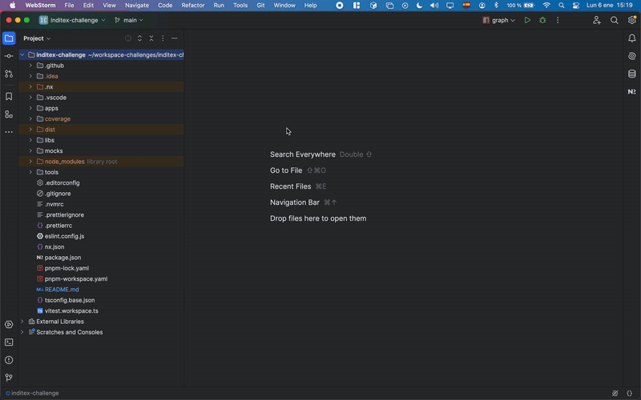

# Podcast Application

## Descripción
La aplicación **Podcast** es un micro-frontend remoto que gestiona la lógica principal de la funcionalidad de podcasts, incluyendo:
- Listado de los podcasts más populares.
- Detalles de un podcast específico.
- Detalles de episodios individuales con un reproductor de audio básico.

Esta aplicación está diseñada para integrarse con el **Shell** mediante **Module Federation**.

---

## Estructura
La estructura principal incluye:

### **`src/`**
Contiene el código fuente de la aplicación. Dentro de esta carpeta, se encuentran las siguientes subcarpetas y archivos:

- **`src/api/`**: Contiene los archivos que gestionan las peticiones a la API utilizando `tanstack/react-query`. Aquí se centraliza toda la lógica de las consultas a la API para mantener el código organizado y desacoplado.

- **`src/app/`**: Es la carpeta raíz de la aplicación donde se encuentra la configuración general de la misma. Aquí se gestionan aspectos como la configuración global y la estructura del enrutado.

- **`src/assets/`**: Contiene todos los recursos estáticos de la aplicación, como imágenes, iconos y otros archivos que no forman parte del código, pero son necesarios para el funcionamiento y la interfaz de usuario.

- **`src/hooks/`**: Aquí se encuentran los hooks personalizados utilizados en toda la aplicación. Estos hooks encapsulan la lógica que puede ser reutilizada a través de los componentes, haciendo que el código sea más limpio y modular.

- **`src/layouts/`**: Contiene los diferentes layouts utilizados en la aplicación. Un layout es una plantilla de interfaz que se utiliza para estructurar las páginas y asegurar una apariencia coherente a través de la aplicación.

- **`src/models/`**: Aquí se definen los modelos de datos de la aplicación, que son utilizados para gestionar y validar la información. Los modelos permiten mantener la consistencia de los datos en todo el proyecto.

- **`src/pages/`**: Contiene las páginas de la aplicación, las cuales corresponden a las rutas definidas en el enrutado. Algunas de las páginas son:
  - **episode-player**: Muestra un episodio individual de un podcast con su reproductor y descripción.
  - **episodes-list**: Lista de episodios de un podcast específico.
  - **podcasts-details**: Muestra los detalles de un podcast, incluyendo una lista de episodios.
  - **podcasts-grid**: Muestra los podcasts más populares en un formato de cuadrícula.
    Cada una de estas páginas maneja su propia lógica de presentación y carga de datos.

- **`src/routing/`**: Define y configura las rutas de la aplicación. Gestiona la navegación entre las distintas vistas de la SPA (Single Page Application), asegurando una experiencia de usuario fluida sin recargar la página.

- **`src/store/`**: Contiene la gestión del estado de la aplicación, probablemente utilizando una librería de manejo de estado (como Redux o Zustand). Aquí se centraliza todo el estado global de la aplicación, permitiendo que los componentes puedan acceder a él de manera eficiente.

- **`src/tests/`**: Configuración de los tests con Vitest. Aquí se configuran y organizan los tests unitarios, de integración y end-to-end para asegurar que la aplicación funciona correctamente y que cualquier cambio en el código no rompa funcionalidades existentes.

- **`src/ui/`**: Contiene los componentes comunes reutilizables en la aplicación, como botones, formularios, modales y otros elementos de la interfaz de usuario. Estos componentes están diseñados para ser reutilizados a lo largo de la aplicación, promoviendo la consistencia visual.

- **`vite.config.ts`**: Configuración para exponer la aplicación como remota.

---

## Scripts
Desde el directorio raíz del proyecto:

### Desarrollo
- **Arrancar la aplicación Podcast en modo desarrollo**:
  ```bash
  pnpm start:project:dev --PROJECT=podcast
  ```

- **Vista previa en modo producción**:
  ```bash
  pnpm start:project:preview --PROJECT=podcast
  ```

### Construcción
- **Construir la aplicación**:
  ```bash
  pnpm build:apps
  ```

### Testing
- **Ejecutar pruebas unitarias**:
  ```bash
  pnpm test:project --PROJECT=podcast
  ```
- **Ejecutar pruebas con interfaz gráfica de Vitest**:
  ```bash
  pnpm test:project:ui --PROJECT=podcast
  ```

---

## Detalles Técnicos
### Module Federation
El archivo `vite.config.ts` declara la configuración necesaria para que esta aplicación sea consumida como un micro-frontend remoto por el Shell.

### Funcionalidades
1. **Listado de Podcasts**: Consume el API de Apple Podcasts y utiliza la librería `@inditex-challenge/api` para gestionar las peticiones.
2. **Detalles de un Podcast**: Renderiza componentes reutilizables como **cdk-card** y **cdk-table** desde el design system.
3. **Detalles de un Episodio**: Incluye un reproductor de audio HTML5 básico para reproducir episodios.

### Dependencias

La aplicación tiene dependencias con las librerías reutilizables:
- Componentes del Design System (**cdk**) es importada desde la librería `@inditex-challenge/cdk`.
- Api del Design System (**api**) es importada desde la librería `@inditex-challenge/api`.
- Icons del Design System (**icons**) es importada desde la librería `@inditex-challenge/icons`.
- Api del Design System (**router**) es importada desde la librería `@inditex-challenge/router`.
- Api del Design System (**utils**) es importada desde la librería `@inditex-challenge/utils`.

---

## Notas
1. Asegúrate de que la aplicación Shell esté ejecutándose para interactuar completamente con esta aplicación.
2. Utiliza `pnpm graph` para visualizar las dependencias entre los micro-frontends y las librerías.



3. La funcionalidad de filtrado utiliza la librería `@inditex-challenge/utils` para operaciones comunes.

---

Para más información, consulta la documentación general en el README del root.
