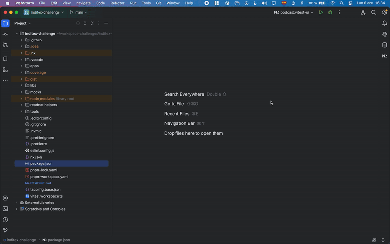
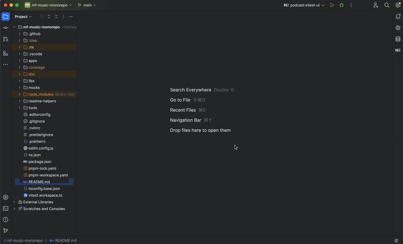
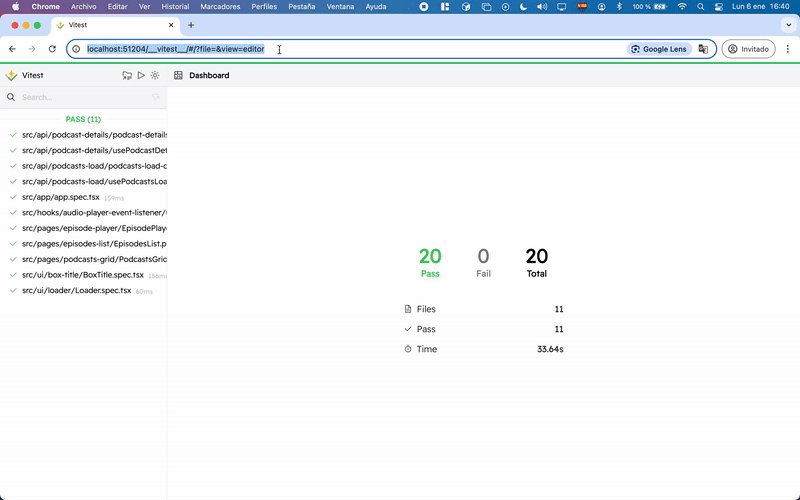

# Shell Application

## Description
The **Shell** application acts as the main host in the micro-frontend architecture. It is responsible for:
- Rendering the common header (**cdk-header**).
- Managing navigation between micro-frontends.
- Dynamically loading the remote application (**Podcast**) using **Module Federation**.

---

## Structure
The main project structure includes:
- **`src/app/`**: Contains the main components of the application.
- **`src/assets/`**: Static files and resources.
- **`src/layouts/`**: Contains the different layouts used in the application. A layout is an interface template used to structure pages and ensure consistent appearance throughout the application.
- **`src/routing/`**: Defines and configures the application routes. It manages navigation between different views of the SPA (Single Page Application), ensuring a smooth user experience without reloading the page.
- **`src/types/`**: Defines types for remote modules.
- **`vite.config.ts`**: Module Federation configuration to declare remote dependencies.

---

## Scripts
From the root directory of the project:

### Development
- **Start the Shell application in development mode**:
  ```bash
  PROJECT=shell pnpm start:project:dev
  ```

- **Preview in production mode**:
  ```bash
  PROJECT=shell pnpm start:project:preview 
  ```

### Build
- **Build the application**:
  ```bash
  pnpm build:apps
  ```

### Testing
- **Run unit tests**:
  ```bash
  PROJECT=shell pnpm test:project
  ```
- **Run tests with Vitest UI**:
  ```bash
  PROJECT=shell pnpm test:project:ui
  ```

  #### **With Nx Console**:

  

  #### **With the terminal**:

  

  #### **Vitest UI**

  

---

## Technical Details
### Module Federation
The **Shell** declares the Module Federation configuration in the `vite.config.ts` file to dynamically load the remote application:
- **Remote**: `podcast`.
- **Shared components**: React, React DOM, and related dependencies.

### Header
The reusable header (**cdk-header**) is imported from the `@sdf-design-system/cdk` library.

### Navigation
The `@sdf-design-system/router` library is used to manage routes within the Shell and delegate navigation to the remote micro-frontend.

---

## Notes
1. Ensure the remote service (Podcast) is running before testing shared functionalities.
2. The `pnpm graph` command can help you visualize the dependencies between projects and libraries.


---

For more information, consult the general documentation in the root README.
