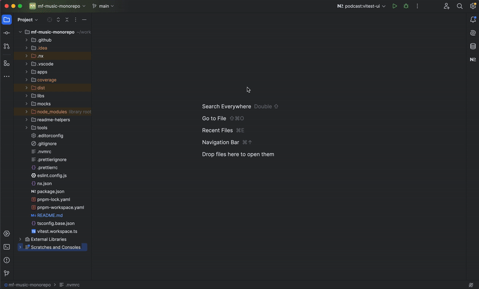

# Librerías del Design System

## Descripción
La carpeta **libs/** contiene las librerías reutilizables que forman el Design System del proyecto. Estas librerías encapsulan la lógica común y los componentes compartidos, promoviendo la reutilización y la consistencia entre las aplicaciones del monorepo.

---

## Librerías Principales

### 1. **API**
- **Descripción**: Encapsula las peticiones HTTP hacia las APIs externas, incluyendo la gestión de CORS mediante `allorigins.win`.
- **Características**:
  - Gestión del cliente de consultas (`react-query`).
  - Métodos para recuperar podcasts y detalles.

### 2. **CDK (Component Dev Kit)**
- **Descripción**: Exposición de componentes reutilizables.
- **Componentes clave**:
  - **cdk-card**: Renderiza detalles de un podcast.
  - **cdk-header**: Cabecera principal utilizada en el Shell.
  - **cdk-input-filter**: Filtro dinámico para la lista de podcasts.
  - **cdk-table**: Lista de episodios.
  - **cdk-thumbnail**: Miniaturas de los podcasts.

### 3. **Icons**
- **Descripción**: Librería de iconos reutilizables.
- **Características**:
  - Exporta iconos SVG.

### 4. **Router**
- **Descripción**: Centraliza la lógica de enrutamiento.
- **Características**:
  - Exporta componentes y hooks relacionados con `react-router-dom`.

### 5. **Utils**
- **Descripción**: Funcionalidades comunes para manejo de fechas, strings, y formatos.

---

## Scripts
Desde el directorio raíz del proyecto:

### Construcción
- **Construir todas las librerías**:
  ```bash
  pnpm build:libs
  ```

### Testing
- **Ejecutar pruebas de todas las librerías**:
  ```bash
  pnpm test:all
  ```
- **Ejecutar pruebas de una librería específica** (reemplaza `$PROJECT`):
  ```bash
  pnpm test:project --PROJECT=cdk-card
  ```
- **Ejecutar pruebas con interfaz gráfica de Vitest**: (reemplaza `$PROJECT`):
  ```bash
  pnpm test:project:ui --PROJECT=cdk-card
  ```

  #### **Con la consola de Nx****:

  

  #### **Con el terminal**:

  

  #### **Vitest UI**

  

### Creación de Librerías
- **Nueva librería estándar**:
  ```bash
  pnpm new:lib --name=my-lib
  ```
- **Nueva librería CDK**:
  ```bash
  pnpm new:cdk:lib --name=my-cdk-lib
  ```

---

## Notas
1. Las librerías están configuradas para ser consumidas tanto por las aplicaciones del monorepo como por futuros proyectos.
2. Puedes usar `pnpm graph` para visualizar las relaciones entre las aplicaciones y librerías en el monorepo.



3. La configuración de las librerías utiliza `Nx` para optimizar tareas con cache inteligente.

---

Para más detalles sobre la estructura y los componentes específicos, revisa los archivos individuales dentro de cada subdirectorio.
