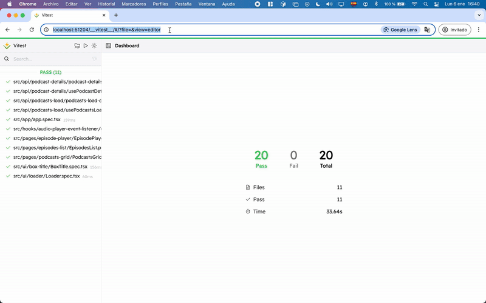

# Librerías del Design System

## Description
The **libs/** folder contains the reusable libraries that form the project's Design System. These libraries encapsulate common logic and shared components, promoting reuse and consistency across the monorepo applications.

---

## Main Libraries

### 1. **API**
- **Description**: Encapsulates HTTP requests to external APIs, including CORS management via `allorigins.win`.
- **Features**:
  - Query client management (`react-query`).
  - Methods for fetching podcasts and details.

### 2. **CDK (Component Dev Kit)**
- **Description**: Exposes reusable components.
- **Key components**:
  - **cdk-card**: Renders podcast details.
  - **cdk-header**: Main header used in the Shell.
  - **cdk-input-filter**: Dynamic filter for the podcast list.
  - **cdk-table**: Episode list.
  - **cdk-thumbnail**: Podcast thumbnails.

### 3. **Icons**
- **Description**: Library of reusable icons.
- **Features**:
  - Exports SVG icons.

### 4. **Router**
- **Description**: Centralizes routing logic.
- **Features**:
  - Exports components and hooks related to `react-router-dom`.

### 5. **Utils**
- **Description**: Common utilities for handling dates, strings, and formats.

---

## Scripts
From the root directory of the project:

### Build
- **Build all libraries**:
  ```bash
  pnpm build:libs
  ```

### Testing
- **Run tests for all libraries**:
  ```bash
  pnpm test:all
  ```
- **Run tests for a specific library** (replace `$PROJECT`):
  ```bash
  PROJECT=cdk-card pnpm test:project
  ```
- **Run tests with Vitest UI**: (replace `$PROJECT`):
  ```bash
  PROJECT=cdk-card pnpm test:project:ui
  ```

  #### **With Nx Console**:

  

  #### **With the terminal**:

  

  #### **Vitest UI**

  

### Library Creation
- **Create a new standard library**:
  ```bash
  pnpm new:lib --name=my-lib
  ```
- **Create a new CDK library**:
  ```bash
  pnpm new:cdk:lib --name=my-cdk-lib
  ```

---

## Notes
1. The libraries are configured to be consumed both by the monorepo applications and by future projects.
2. You can use `pnpm graph` to visualize the relationships between applications and libraries in the monorepo.


3. Library configuration uses `Nx` to optimize tasks with smart caching.

---

For more details about the structure and specific components, refer to the individual files within each subdirectory.
